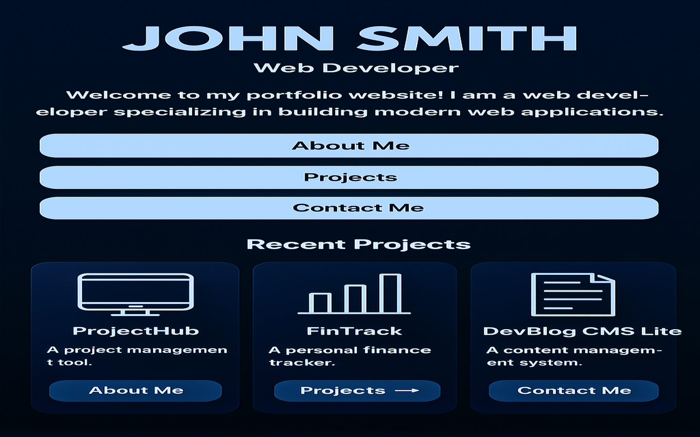

# Ivan Vaic – Portfolio v2

This repository contains the source code for my personal portfolio built with **React**, **Vite**, **TailwindCSS**, **Framer Motion** and **Lenis**. The site showcases a handful of demo projects and provides a quick way to download my CV or reach out on social platforms.

## Live Demo

The site is deployed on GitHub Pages. Visit it at:

```
https://ivanvaic99.github.io/portfolio-v2/
```



## Features

- **Responsive design** – Optimised layouts for both desktop and mobile screens.
- **Dark/light mode** – Toggle between themes, with your preference stored in `localStorage`.
- **Smooth scrolling** – Implemented via Lenis for buttery‑smooth navigation.
- **Animated transitions** – Sections gently fade and slide into view thanks to Framer Motion.
- **SEO friendly** – Includes meta tags, OpenGraph tags and a favicon.
- **Projects section** – Dynamically populated from `src/data/projects.js` and linking to live demos and GitHub repositories.
- **Skills badges** – Icons loaded from [skillicons.dev](https://skillicons.dev).
- **Contact information** – Location, email and quick links to LinkedIn and GitHub.

## Tech Stack

| Category  | Libraries / Tools               |
|---------:|---------------------------------|
| Framework | React 18                        |
| Build     | Vite                            |
| Styling   | TailwindCSS                     |
| Animations | Framer Motion, Lenis          |
| Deployment | GitHub Pages + GitHub Actions |

## Getting Started

1. **Install dependencies**

   ```sh
   npm install
   ```

2. **Run the development server**

   ```sh
   npm run dev
   ```

3. **Build for production**

   ```sh
   npm run build
   ```

   The compiled site will be output to the `dist/` folder.

4. **Preview the build**

   ```sh
   npm run preview
   ```

## Deployment

This repository is configured to deploy automatically to GitHub Pages using the workflow defined in `.github/workflows/deploy.yml`. On each push to the `main` branch the site will be built and the `dist/` folder will be published. Ensure the repository’s Pages settings are set to deploy from **GitHub Actions**.

## Screenshots

Screenshots for both the portfolio and the demo projects live under [`public/screenshots`](./public/screenshots). Cover images used in the Projects section live under [`public/previews`](./public/previews).

## License

This project is provided for educational purposes. Feel free to fork and adapt it for your own portfolio.